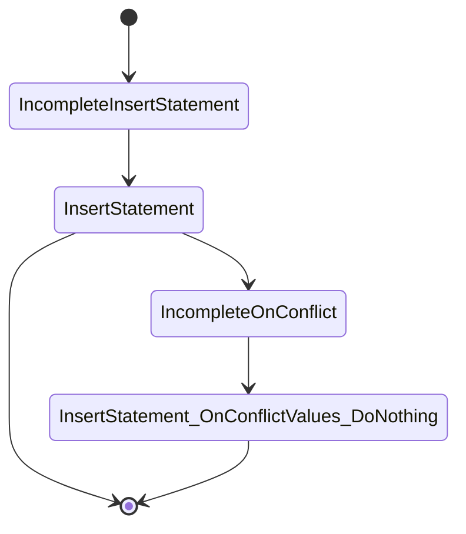

# Diesel Internals

---
---
# Table of contents

<Toc text-sm minDepth="1" maxDepth="2" />

---
layout: section
---

# *Rust Typesystem* is a language

---
level: 2
---

## Example: binary operation

```rust
struct B0; struct B1;

trait Bit {
    type Not: Bit;
    type And<B: Bit>: Bit;
}

impl Bit for B0 {
    type Not = B1;
    type And<B: Bit> = B0;
}

impl Bit for B1 {
    type Not = B0;
    type And<B: Bit> = B;
}
```


<style>
img  {
  position: absolute;
  top: 50%;
  left: 50%;
  transform: translate(-50%, -50%);
  width: 60%;
}
</style>

---
level: 2
---

## Example: binary number

```rust {all|6}
struct UInt<U: Unsigned, B: Bit> {
    msb: U,
    lsb: B,
}

type U6 = UInt<UInt<UInt<(), B1>, B1>, B0>;

trait Unsigned {}
impl<U, B> Unsigned for UInt<U, B> where U: Unsigned, B: Bit { }
impl Unsigned for () {}
```

---
layout: center
level: 2
---


<style>
img  {
  position: absolute;
  top: 50%;
  left: 50%;
  transform: translate(-50%, -50%);
  width: 75%;
}
</style>


---
layout: fact
level: 2
---


<style>
img  {
  position: absolute;
  top: 50%;
  left: 50%;
  transform: translate(-50%, -50%);
  width: 75%;
}
</style>

---
layout: center
level: 2
---
```rust
forth!(
    : factorial (n -- n) 1 swap fact0 ;
    : fact0 (n n -- n) dup 1 = if drop else dup rot * swap pred fact0 then ;
    5 factorial .
);
```
---
layout: center
level: 2
---
```rust
pub trait factorial {
   type Result;
}
impl<V, N> factorial for Node<V, N>
where
    Self: one,
    <Self as one>::Result: swap,
    <<Self as one>::Result as swap>::Result: fact0,
{
    type Result = <<<Self as one>::Result as swap>::Result as fact0>::Result;
}
pub trait fact0 {
    type Result;
}
impl <V ,N> fact0 for Node <V ,N>
where
    Self: dup,
    <Self as dup>::Result: one,
    <<Self as dup>::Result as one>::Result: eq,
    ...
{
    type Result = <<<<<<<<<<<<<Self as dup>::Result as one>::Result as eq>::Result as iff>::Result... 
    ...
}
println!("{}", <<<Empty as five>::Result as factorial>::Result as top>::Result::eval());
```

---
layout: center
level: 2
---


<style>
img  {
  position: absolute;
  top: 50%;
  left: 50%;
  transform: translate(-50%, -50%);
  width: 75%;
}
</style>

---
layout: cover
---

# Diesel AST

---
lever: 2
---

# AST nodes
```rust
    struct Eq<T, U> {
        left: T,
        right: U,
    }

    struct FromClause<F: QuerySource> {
      source: F,
      from_clause: F::FromClause,
    }

    struct SelectStatement<From, Select, Distinct, Where, Order, LimitOffset, GroupBy, Having, Locking> {
      select: Select,
      from: From,
      distinct: Distinct,
      where_clause: Where,
      order: Order,
      limit_offset: LimitOffset,
      group_by: GroupBy,
      having: Having,
      locking: Locking,
  }
```

---
lever: 2
---

# Expanded Example Query
```rust
    users::table.filter(users::id.eq(42)).select(users::id)
```

##### Internal API
```rust
  // The internal API
  SelectStatement<
      FromClause<users::table>, 
      SelectClause<users::id>, 
      WhereClause<Eq<users::id, Bound<i32, Integer>>>, 
      // ...
  >
```

##### With Public API
```rust
  use diesel::dsl::*;
  Select<
      Filter<users::table, Eq<users::id, i32>>,
      users::id
  >
```

---
lever: 2
---

# To the wire
```rust
  pub trait QueryFragment<DB: Backend, SP = NotSpecialized> {
      fn walk_ast<'b>(&'b self, pass: AstPass<'_, 'b, DB>) 
          -> QueryResult<()>;
  }
```

```rust
  impl<L, R> QueryFragment<Pg> for Eq<L, R>
    where
        L: QueryFragment<Pg>, R: QueryFragment<Pg>,
  {
      fn walk_ast(&self, mut pass: AstPass<DB>) -> QueryResult<()> {
          self.left.walk_ast(pass.reborrow())?;
          pass.push_sql(" = ");
          self.right.walk_ast(pass.reborrow())
      }
  }
```

<!-- Visitor pattern -->

---
---

# DSL: Type State Builder
```rust
  struct IncompleteInsertStatement<T, Op> { ... }
  struct InsertStatement<T, U, Op, Ret> { ... }
  struct IncompleteOnConflict<Stmt, Target> { ... }
 
  fn insert_into<T: Table>(target: T) -> IncompleteInsertStatement<T>;

  impl<T, Op> IncompleteInsertStatement<T, Op> where ... {
    fn values<U>(self, records: U) -> InsertStatement<T, U::Values, Op> { ... }
  }

  impl<T, U, Op, Ret> InsertStatement<T, U, Op, Ret> where ... {
    fn on_conflict_do_nothing(self)
      -> InsertStatement<T, OnConflictValues<U::ValueClause, NoConflictTarget, DoNothing<T>>, Op, Ret> { ... }

    fn on_conflict<Target>(self, target: Target)
      -> IncompleteOnConflict<InsertStatement<T, U::ValueClause, Op, Ret>, ConflictTarget<Target>> { ... }
  }

  
```
---
layout: center
---

---
---
# Table macro
Contains zero sized structs that represent your table + columns

````md magic-move
```rust
diesel::table! {
    users {
        id -> Integer,
        name -> Text,
    }
}
```

```rust
mod users {
    pub struct table;
    mod columns {
        pub struct id;
        pub struct name;
    }

    impl diesel::QuerySource for table { ... }
    impl diesel::Table for table { ... }
    impl diesel::associations::HasTable for table { ... }
    impl diesel::query_source::AppearsInFromClause<table> for table {

    impl diesel::query_source::Column for id { ... }
    impl diesel::query_source::Column for name { ... }

    ...
}
```
````
---
layout: section
---
# Diesel Type check on type system

---
---
# Expression Trait
A marker trait representing a typed SQL fragment
```rust 
pub trait Expression {
    type SqlType;
}
```

```rust {full|*}
impl<L, R> Expression for Eq<L, R> {
    type SqlType = Bool;
}

// Implemented by table! trait
impl diesel::expression::Expression for id {
    type SqlType = Int4;
}
```
---
lever: 2
---
## Example: Checking filter is Bool

````md magic-move
```rust
// Marker trait
trait Boolean {}
impl Boolean for Bool {}

trait QueryDsl  {
    fn filter<Predicate>(self, predicate: Predicate) -> Filter<Self, Predicate>
      where
        Predicate: Expression,
        <Predicate as Expression>::SqlType: Boolean
    { ... }
}
```

```rust {5-16|all}
pub trait BoolOrNullableBool {}
impl BoolOrNullableBool for Bool {}
impl BoolOrNullableBool for Nullable<Bool> {}

// https://github.com/diesel-rs/diesel/blob/master/diesel/src/query_builder/select_statement/dsl_impls.rs#L195-L202
impl<F, S, D, W, O, LOf, G, H, LC, Predicate> FilterDsl<Predicate>
    for SelectStatement<F, S, D, W, O, LOf, G, H, LC>
where
    Predicate: Expression + NonAggregate,
    Predicate::SqlType: BoolOrNullableBool,
    W: WhereAnd<Predicate>,
{
    type Output = SelectStatement<F, S, D, W::Output, O, LOf, G, H, LC>;

    fn filter(self, predicate: Predicate) -> Self::Output { ... }
}
```
````
---
---
### Futher Read
- [A non-overlapping type level contains operation for heterogeneous lists - Georg Semmler](https://blog.weiznich.de/blog/eurorust-non-overlapping-contains-for-hlists/)

---
layout: end
---
# Obrigado

